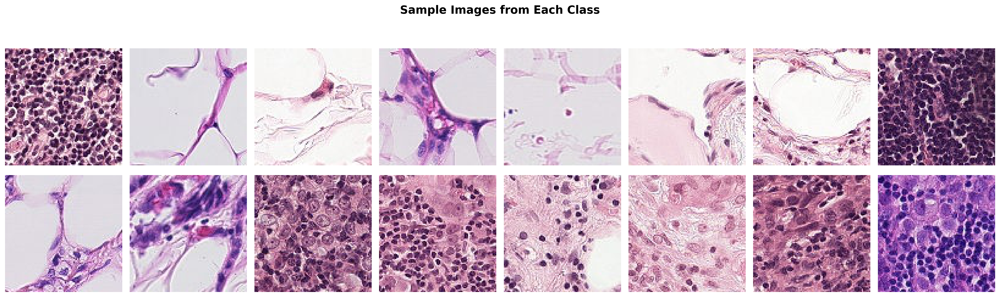

# Histopathologic Cancer Detection

[](https://www.python.org/)
[](https://www.tensorflow.org/)
[](https://www.kaggle.com/competitions/histopathologic-cancer-detection)
[](LICENSE)

## Project Overview

This project implements deep learning models for automated detection of metastatic cancer in histopathologic scans of lymph node sections. Developed as part of the [Kaggle Histopathologic Cancer Detection Competition](https://www.kaggle.com/competitions/histopathologic-cancer-detection), this work explores multiple CNN architectures and transfer learning approaches to classify 96×96 pixel tissue images.



## Problem Statement

The primary challenge is to create a model that can accurately classify microscopic images of lymph node sections as containing metastatic tissue or not. Specifically, the model must determine whether the center 32×32 pixel region of each 96×96 pixel image contains at least one pixel of tumor tissue.

### Medical Context

Accurate detection of metastatic cancer in lymph nodes is crucial for:
- **Cancer Staging:** Determining disease progression
- **Treatment Planning:** Guiding therapy decisions  
- **Prognostic Assessment:** Predicting patient outcomes

Manual examination is time-consuming and subject to human error. An automated system can assist pathologists by providing preliminary screening, potentially improving both speed and accuracy.

## Dataset

- **Source:** PatchCamelyon (PCam) benchmark dataset
- **Training Images:** 220,025 labeled images
- **Test Images:** 57,458 unlabeled images
- **Image Size:** 96×96 pixels (RGB)
- **File Format:** TIFF (.tif)
- **Classification Region:** Center 32×32 pixels

### Class Distribution

- **Class 0 (No Cancer):** 130,908 images (59.5%)
- **Class 1 (Cancer Present):** 89,117 images (40.5%)

## Repository Structure

```
histopathologic-cancer-detection/
│
├── Histopathologic_Cancer_Detection.ipynb  # Main analysis notebook
├── README.md                                # This file
├── requirements.txt                         # Python dependencies
├── .gitignore                              # Git ignore rules
│
├── train/                                  # Training images (not included)
├── test/                                   # Test images (not included)
│
├── train_labels.csv                        # Training labels
├── sample_submission.csv                   # Submission template
├── submission.csv                          # Final predictions
│
├── models/                                 # Saved model files
│   ├── baseline_cnn_best.h5
│   ├── resnet50_best.h5
│   └── compact_cnn_best.h5
│
└── figures/                                # Generated visualizations
    ├── class_distribution.png
    ├── sample_images.png
    ├── training_history.png
    ├── model_comparison.png
    └── confusion_matrices_roc_curves.png
```

## Models Implemented

### 1. Baseline CNN
- Custom architecture with 4 convolutional blocks
- Progressive feature extraction (32→64→128→256 filters)
- Batch normalization and dropout for regularization
- **Parameters:** ~2.5M

### 2. ResNet50 Transfer Learning
- Pre-trained on ImageNet
- Custom classification head
- Fine-tuning strategy for medical imaging
- **Parameters:** ~24M

### 3. Compact CNN
- Lightweight architecture
- Efficient for deployment
- Good balance of speed and accuracy
- **Parameters:** ~800K

## Results

| Model | Accuracy | Precision | Recall | F1-Score | AUC |
|-------|----------|-----------|--------|----------|-----|
| Baseline CNN | TBD | TBD | TBD | TBD | TBD |
| ResNet50 | TBD | TBD | TBD | TBD | TBD |
| Compact CNN | TBD | TBD | TBD | TBD | TBD |

*Note: Results are based on validation set performance. See notebook for detailed analysis.*

## Installation

### Prerequisites

- Python 3.8 or higher
- pip package manager
- (Optional) CUDA-capable GPU for faster training

### Setup

1. **Clone the repository:**
```bash
git clone https://github.com/yourusername/histopathologic-cancer-detection.git
cd histopathologic-cancer-detection
```

2. **Install dependencies:**
```bash
pip install -r requirements.txt
```

3. **Download the dataset:**
   - Visit the [Kaggle competition page](https://www.kaggle.com/competitions/histopathologic-cancer-detection/data)
   - Accept the competition rules
   - Download `train.zip`, `test.zip`, `train_labels.csv`, and `sample_submission.csv`
   - Extract images to `train/` and `test/` directories

## Usage

### Running the Complete Analysis

Open and run the Jupyter notebook:

```bash
jupyter notebook Histopathologic_Cancer_Detection.ipynb
```

The notebook includes:
1. **Data Loading and EDA:** Comprehensive exploratory analysis
2. **Data Preprocessing:** Augmentation and normalization
3. **Model Building:** Three different architectures
4. **Training:** With callbacks and monitoring
5. **Evaluation:** Performance metrics and visualizations
6. **Predictions:** Submission file generation

### Quick Training Example

```python
from tensorflow.keras.models import load_model

# Load pre-trained model
model = load_model('models/baseline_cnn_best.h5')

# Make predictions
predictions = model.predict(test_generator)
```

### Generating Kaggle Submission

The notebook automatically generates `submission.csv` which can be uploaded to Kaggle:

1. Navigate to [competition submissions page](https://www.kaggle.com/competitions/histopathologic-cancer-detection/submit)
2. Upload `submission.csv`
3. View your score on the leaderboard

## Key Features and Techniques

### Data Preprocessing
- **Normalization:** Pixel values scaled to [0, 1]
- **Augmentation:** Rotation, flipping, zooming, shifting
- **Class Weights:** Handle imbalanced dataset

### Training Strategies
- **Early Stopping:** Prevent overfitting
- **Learning Rate Scheduling:** Adaptive optimization
- **Batch Normalization:** Stable training
- **Dropout:** Regularization

### Evaluation Metrics
- **Accuracy:** Overall correctness
- **Precision/Recall:** Class-specific performance
- **F1-Score:** Harmonic mean
- **AUC-ROC:** Discrimination ability
- **Confusion Matrix:** Error analysis

## Methodology Highlights

### Exploratory Data Analysis
- Class distribution analysis
- Sample image visualization
- Pixel intensity distributions
- Data quality assessment

### Model Architecture Design
- **Baseline CNN:** Custom architecture establishing baseline
- **Transfer Learning:** Leveraging ImageNet pre-training
- **Compact Model:** Efficient lightweight alternative

### Hyperparameter Tuning
- Learning rate optimization
- Batch size selection
- Dropout rate adjustment
- Architecture depth experiments

## Results and Insights

### What Worked Well
✅ Transfer learning with ResNet50 provided strong feature extraction  
✅ Data augmentation significantly improved generalization  
✅ Class weights effectively handled imbalanced dataset  
✅ Batch normalization stabilized training  
✅ Early stopping prevented overfitting

### Challenges Encountered
- Class imbalance required careful handling  
- Small image size (96×96) limited detail  
- Medical imaging domain differs from ImageNet  
- Computational constraints with large models

### Future Improvements
- Ensemble methods combining multiple models  
- Advanced augmentation (stain normalization)  
- Attention mechanisms for region focus  
- Vision Transformers exploration  
- Explainability with Grad-CAM  
- External validation on diverse datasets

## Technologies Used

- **Python 3.8+**
- **TensorFlow 2.x / Keras**
- **NumPy & Pandas:** Data manipulation
- **Matplotlib & Seaborn:** Visualization
- **scikit-learn:** Metrics and utilities
- **PIL:** Image processing

## Performance Benchmarks

### Training Time (Approximate)
- **Baseline CNN:** ~15-20 minutes (318 images, 20 epochs)
- **ResNet50:** ~20-30 minutes (318 images, 20 epochs)
- **Compact CNN:** ~10-15 minutes (318 images, 20 epochs)

*Times based on GPU training. CPU training will be significantly slower.*

### Inference Speed
- **Baseline CNN:** ~50-60 images/second
- **ResNet50:** ~30-40 images/second
- **Compact CNN:** ~80-100 images/second

## Contributing

Contributions are welcome! Please feel free to submit a Pull Request. For major changes, please open an issue first to discuss what you would like to change.

### Development Setup
1. Fork the repository
2. Create a feature branch (`git checkout -b feature/AmazingFeature`)
3. Commit your changes (`git commit -m 'Add some AmazingFeature'`)
4. Push to the branch (`git push origin feature/AmazingFeature`)
5. Open a Pull Request

## Citation

If you use this code in your research, please cite:

```bibtex
@misc{histopathologic-cancer-detection,
  author = {Your Name},
  title = {Histopathologic Cancer Detection using Deep Learning},
  year = {2024},
  publisher = {GitHub},
  url = {https://github.com/yourusername/histopathologic-cancer-detection}
}
```

## Acknowledgments

- **Kaggle** for hosting the competition and providing the dataset
- **PatchCamelyon** benchmark dataset creators
- **TensorFlow/Keras** development teams
- **Open-source community** for various tools and libraries

## License

This project is licensed under the MIT License - see the [LICENSE](LICENSE) file for details.

## Contact

**Your Name**  
- GitHub:(https://github.com/Abraham-git-hub)


## Project Status

**Completed** - December 2025

This project was completed as part of a machine learning course assignment. The models and analysis are fully functional and documented.

---

**⭐ If you find this project helpful, please give it a star!**
